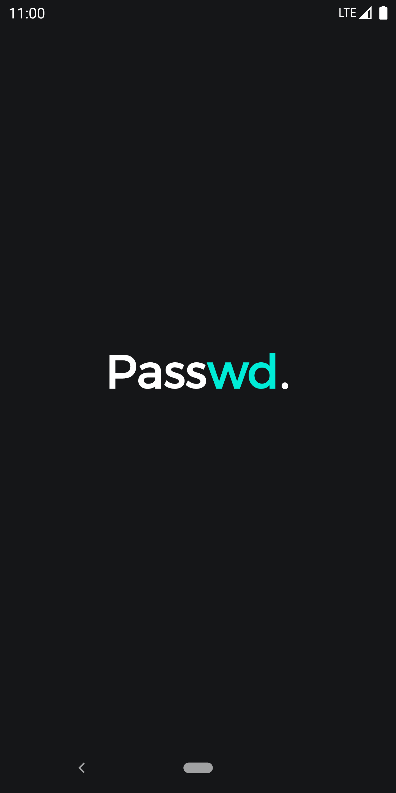
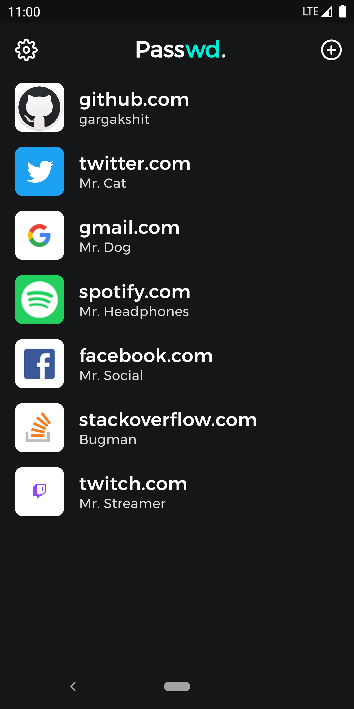
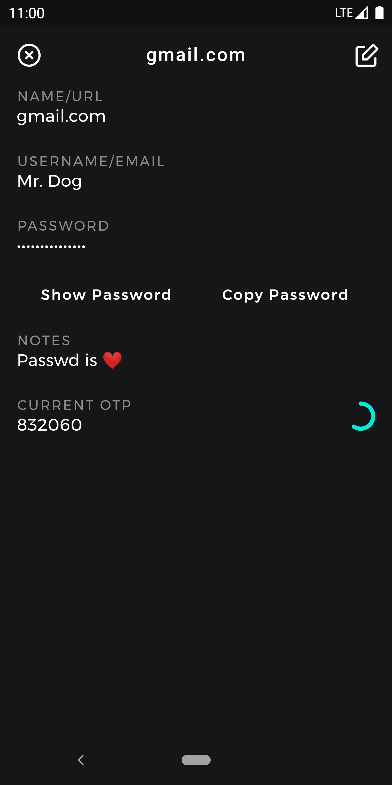
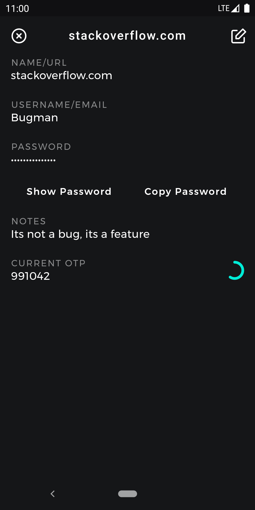
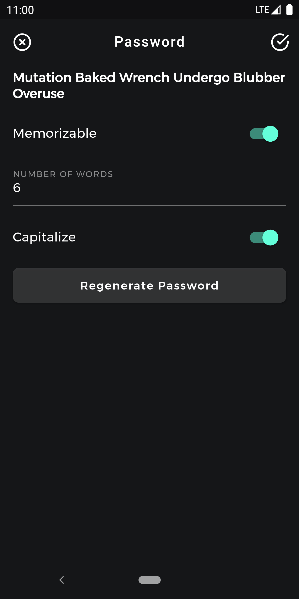
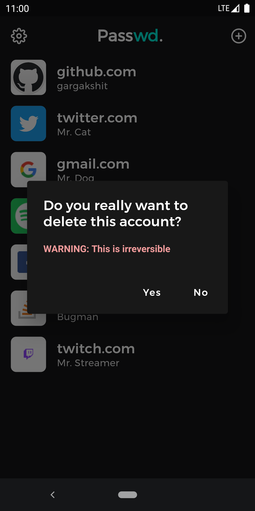
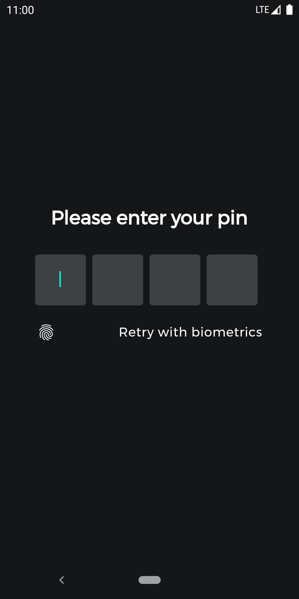

# Passwd.

A beautiful, encrypted password manager, built using Flutter and Dart.

## Features

- Fully encrypted using AES-256-CTR (including the database stored on-device)
- Support for TOTP
- Secure Password Generation (Diceware and Random)
- A really nice UI
- Really compact database, allowing for efficient disk operations (Thanks to MsgPack)
- Desktop Support (Beta)
- Responsive UI (Beta) (Desktop and mobile UIs, tablet needs to be re-written)

## Screenshots

Nothing is complete without screenshots :P

  
  
  
  
  
  
  
  
  

## Building

- Install [Flutter](https://flutter.dev)
- Switch to the master channel: `flutter channel master`
- Run `flutter upgrade`
- Clone the repository

### Android

- Connect your device / emulator to your computer
- `flutter run`

### iOS

- Connect your device / simulator to your computer (only macs are supported)
- `flutter run`

### Desktop

- See hover's build instructions [here](https://github.com/go-flutter-desktop/hover)

## Contributors

See [CONTRIBUTORS.md](./CONTRIBUTORS.md).

## Roadmap

See [ROADMAP.md](./ROADMAP.md).
